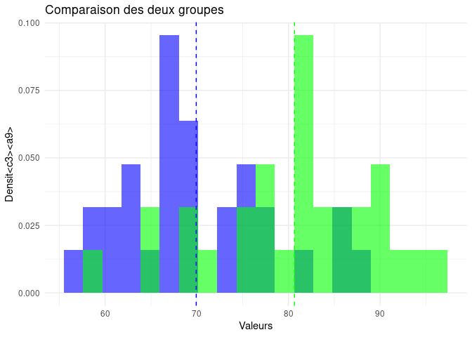

# documentation_T_test_Bio

<!-- badges: start -->
<!-- badges: end -->

📌 Description

Le package documentation_T_test_Bio permet d’effectuer des tests de
Student (T-Test) sur des échantillons simulés ou réels. Il prend en
charge plusieurs types de tests :

Test à un échantillon Test pour deux échantillons classiques Test de
Welch (variances inégales) Test apparié Il fournit également :

L’interprétation automatique des résultats La puissance statistique du
test Des visualisations graphiques des distributions

🚀 Installation

Vous pouvez installer la version de développement directement depuis
GitHub :

``` r
# Installer le package depuis GitHub
# install.packages("devtools")
devtools::install_github("Oumarfr/documentation")
#> Using GitHub PAT from the git credential store.
#> Downloading GitHub repo Oumarfr/documentation@HEAD
#> rlang      (1.1.3 -> 1.1.5 ) [CRAN]
#> glue       (1.7.0 -> 1.8.0 ) [CRAN]
#> cli        (3.6.2 -> 3.6.4 ) [CRAN]
#> pillar     (1.9.0 -> 1.10.1) [CRAN]
#> colorspace (2.1-0 -> 2.1-1 ) [CRAN]
#> R6         (2.5.1 -> 2.6.1 ) [CRAN]
#> withr      (3.0.0 -> 3.0.2 ) [CRAN]
#> gtable     (0.3.5 -> 0.3.6 ) [CRAN]
#> Installing 8 packages: rlang, glue, cli, pillar, colorspace, R6, withr, gtable
#> Installing packages into '/tmp/RtmpiboSSY/temp_libpath1cc8cc8dba9'
#> (as 'lib' is unspecified)
#> ── R CMD build ─────────────────────────────────────────────────────────────────
#> * checking for file ‘/tmp/RtmpPXcfEd/remotes250a2fb759f9/Oumarfr-documentation-fbd2eae/DESCRIPTION’ ... OK
#> * preparing ‘documentation’:
#> * checking DESCRIPTION meta-information ... OK
#> * checking for LF line-endings in source and make files and shell scripts
#> * checking for empty or unneeded directories
#> * building ‘documentation_0.0.0.9000.tar.gz’
#> Installing package into '/tmp/RtmpiboSSY/temp_libpath1cc8cc8dba9'
#> (as 'lib' is unspecified)
```

Puis, chargez le package :

``` r
library(documentation)
```

🛠️ Utilisation

Voici un exemple simple de test de Student classique à deux échantillons
:

``` r
library(documentation)

# Exécuter un test T classique
result <- bio_analyze_t_test(n1 = 30, mean1 = 70, sd1 = 10, 
                             n2 = 30, mean2 = 75, sd2 = 10, 
                             test_type = "two.sample.classique", 
                             alpha = 0.05, alternative = "two.sided")

# Afficher les résultats
print(result$t_test)
#> 
#>  Two Sample t-test
#> 
#> data:  data1 and data2
#> t = -4.7832, df = 58, p-value = 1.224e-05
#> alternative hypothesis: true difference in means is not equal to 0
#> 95 percent confidence interval:
#>  -15.207581  -6.234417
#> sample estimates:
#> mean of x mean of y 
#>  69.93649  80.65749
```

``` r
print(result$interpretation)
#> [1] "Le test est significatif : nous rejetons H0."
```

📊 Visualisation

    #> Warning: The dot-dot notation (`..density..`) was deprecated in ggplot2 3.4.0.
    #> ℹ Please use `after_stat(density)` instead.
    #> ℹ The deprecated feature was likely used in the documentation package.
    #>   Please report the issue at <https://github.com/Oumarfr/documentation/issues>.
    #> This warning is displayed once every 8 hours.
    #> Call `lifecycle::last_lifecycle_warnings()` to see where this warning was
    #> generated.



📖 Documentation

Pour plus d’informations, consultez la documentation complète via :

``` r
help("bio_analyze_t_test")
```

Ou visitez la vignette associée :

``` r
vignette("fonctions-t-test", package = "documentation")
#> Warning: vignette 'fonctions-t-test' not found
```

🔗 Auteur

Développé par Oumar Ibrahim Barry.
